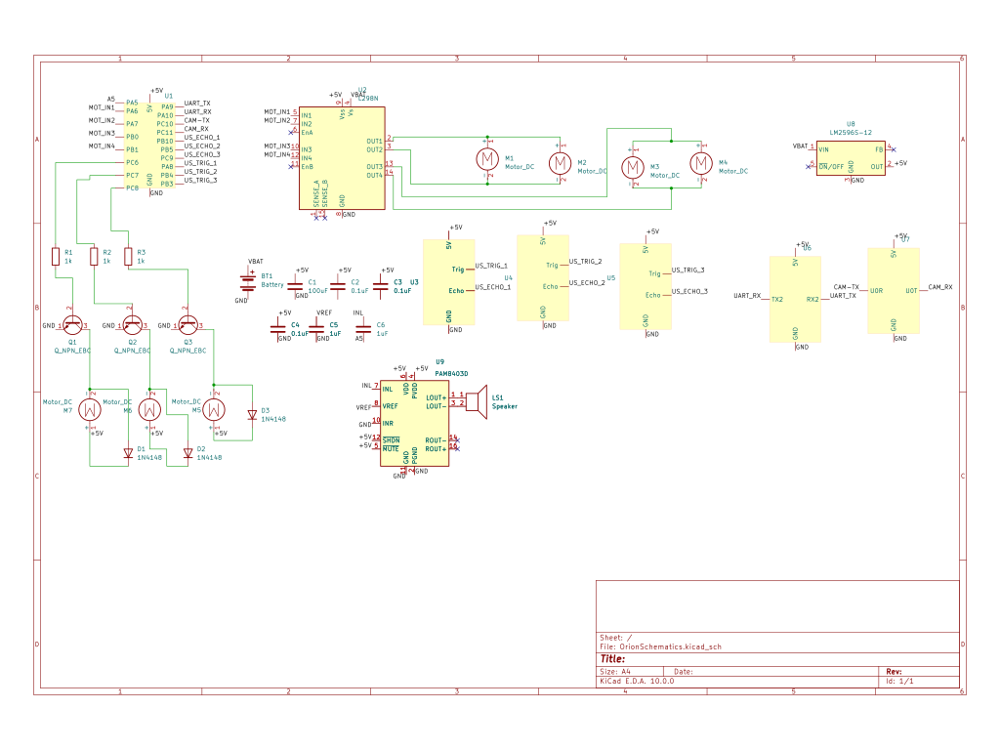

# Orion
An autonomous guide assistant featuring smartphone-linked vector navigation and real-time intelligent disobedience.

:::info 

**Author**: Dorian-Gabriel Toros \
**GitHub Project Link**: https://github.com/UPB-PMRust-Students/fils-project-2026-TorosDorian-Gabriel

:::

<!-- do not delete the \ after your name -->

## Description

Orion is a robotic guide designed to assist visually impaired users with navigation. The system uses a smartphone for high-level tasks like voice processing and environmental recognition (identifying crosswalks or stoplights), while an STM32 handles the real-time movement and safety logic. The phone provides navigation targets—defined by a distance and an angle—which the robot executes. Running an Async Rust stack, the microcontroller manages these instructions while continuously monitoring a triple-ultrasonic sensor array. This enables "Intelligent Disobedience": if a command would lead to a collision or hazard, the robot overrides the input to stop or navigate around the obstacle, prioritizing the user's safety in both indoor and outdoor settings.

## Motivation

I chose this project because I wanted to make guidance more accessible to visually impaired people. While real guide dogs offer incredible emotional support, they aren't a realistic option for everyone due to the high costs involved. A trained guide dog can cost upwards of $50,000, and that’s before you factor in years of food, water, healthcare, and daily care, such as skill maintenance, grooming, and even playing with it. Plus, a dog’s lifespan is limited, so the process and expenses eventually have to start over. Orion is much more accessible. At a much cheaper total build cost, it provides a technical alternative that doesn't need food or vet visits. It has a virtually unlimited lifespan, as long as the hardware is powered and not faulty. While a robot might occasionally need a cheap spare part if something breaks, it’s nothing compared to the ongoing costs of a living animal.

## Architecture 
<div align="center">
  
</div>
The system follows a decentralized command structure, where high-level strategy is handled by a mobile device and real-time safety is handled locally by the robot.

### Main Components
* **Instruction Layer:** A smartphone application that processes user commands and camera data to generate high-level navigation goals.

* **Communication Layer:** A wireless relay (ESP32) that bridges the gap between the smartphone's high-level commands and the robot’s low-level hardware.

* **Control Core:** This unit consists of the STM32 and the ultrasonic sensors array. It acts as the "source of truth", merging high-level instructions with real-time environmental data to manage the robot's physical behavior. It maintains a state history to recognize navigation deadlocks—where the robot is repeatedly blocked—allowing it to halt and alert the user independently.

* **Actuation Layer:** The physical hardware that turns logic into action, including the 4WD drive system and haptic feedback.

### Component Connection
The components are linked via a prioritized data chain:

* **Wireless Link (Wi-Fi/BLE):** Connects the Instruction Layer to the Communication Layer. It uses Wi-Fi for vision data and Bluetooth for low-latency destination commands.

* **Data Bridge (UART):** Connects the Communication Layer to the Control Core. It passes directional vectors (angle and distance) from the ESP32 to the STM32.

* **Safety Loop (GPIO/Timers):** Connects the sensors directly to the Control Core. This link allows the STM32 to measure distance and override navigation commands if an obstacle is determined as unavoidable.

* **Execution Link (PWM/GPIO):** Connects the Control Core to the motor drivers within the Actuation Layer for precise speed and direction control.

* **Haptic Feedback Link (Digital Out):** Connects the Control Core to the coin vibrators. This provides physical alerts to the user, signaling system status or immediate danger.

This architecture establishes the Control Core as the ultimate safety authority. Because the Safety Loop is hard-wired directly to the STM32, the robot maintains a real-time 'safety shield' that operates independently of the smartphone. In any conflict between user instructions and environmental reality—such as a detected unavoidable obstacle or a connection lag—the Control Core is programmed to prioritize safety by overriding external commands. Furthermore, the core is capable of Tactical Halts: if the robot determines it is physically stuck or unable to find a safe path after multiple attempts, it will cease movement and trigger haptic feedback to notify the user of the navigation deadlock, regardless of the smartphone's continued output.

## Log

<!-- write your progress here every week -->
### Week 23 - 29 March
Thought about and planned the project.
### Week 30 March - 5 April
Got my idea approved, started ordering materials needed.
### Week 6 - 12 April
All ordered materials arrived. I started doing small functionality tests to make sure I understand how they work.
### Week 13 - 19 April

### Week 20 - 26 April

### Week 27 April - 3 May

### Week 4 - 10 May

### Week 11 - 17 May

### Week 18 - 24 May

## Hardware

Orion’s hardware is built around a multi-processor architecture to separate real-time control from high-bandwidth data handling. The STM32 acts as the primary core, executing Async Rust logic to process safety data and motor vectors. Connectivity is managed via a dedicated ESP32 module, while a separate ESP32-CAM is utilized specifically for environmental image capture.

For movement, the system uses a 4WD motor and wheel set adapted into a "walker-style" configuration for stable mobility. Obstacle detection is handled by a triple ultrasonic sensor array positioned for wide-angle coverage, ensuring the robot can detect hazards in its immediate path.

The power system is split into two distinct rails for stability: the 4WD motors are powered directly from the Li-ion batteries to handle high current spikes, while a buck converter steps the voltage down to a stable 5V for the breadboard-mounted logic circuits, protecting the microcontrollers from electrical interference.

### Schematics
<div align="center">
  
</div>

### Bill of Materials

<!-- Fill out this table with all the hardware components that you might need.

The format is 
```
| [Device](link://to/device) | This is used ... | [price](link://to/store) |

```

-->

| Device | Usage | Price |
|--------|-------|-------|
| [STM32 Nucleo-U545RE-Q](https://www.st.com/en/evaluation-tools/nucleo-u545re-q.html) | Main microcontroller running Rust control logic. | [286.27 RON](https://ro.mouser.com/ProductDetail/STMicroelectronics/NUCLEO-U545RE-Q?qs=mELouGlnn3cp3Tn45zRmFA%3D%3D)  |

## Software

| Library | Description | Usage |
|---------|-------------|-------|
| [Rust](https://www.rust-lang.org/) | Systems programming language | Core implementation |
| [cortex-m](https://crates.io/crates/cortex-m) | ARM Cortex-M low-level access | Register and interrupt control |
| [cortex-m-rt](https://crates.io/crates/cortex-m-rt) | Runtime support | Startup and interrupt handling |
| [embedded-hal](https://crates.io/crates/embedded-hal) | Hardware abstraction layer | Peripheral interfaces |
| [embassy-executor](https://crates.io/crates/embassy-executor) | Async executor | Runs concurrent tasks |
| [embassy-time](https://crates.io/crates/embassy-time) | Time management | Delays and scheduling |
| [embassy-stm32](https://crates.io/crates/embassy-stm32) | STM32 HAL | GPIO, UART, PWM control |
| [heapless](https://crates.io/crates/heapless) | Fixed-size data structures | Memory-safe buffers |
| [embassy-sync](https://crates.io/crates/embassy-sync) | Synchronization primitives | Task coordination |
| [defmt](https://crates.io/crates/defmt) | Logging framework | Debugging output |
| [defmt-rtt](https://crates.io/crates/defmt-rtt) | RTT transport | Real-time logs |
| [panic-halt](https://crates.io/crates/panic-halt) | Panic handler | Stops execution on error |
| [nb](https://crates.io/crates/nb) | Non-blocking abstractions | Peripheral communication |


## Links

<!-- Add a few links that inspired you and that you think you will use for your project -->

1. [crates.io](https://crates.io/)
2. [embedded-rust](https://embedded-rust-101.wyliodrin.com/)
3. [STM32-U545RE-Q datasheet](https://www.st.com/resource/en/datasheet/stm32u545ce.pdf)
4. [embassy.dev](https://embassy.dev/)
